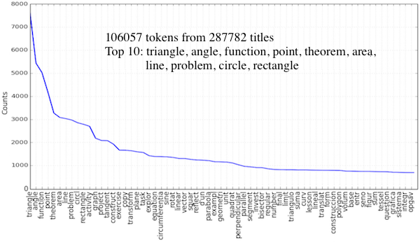
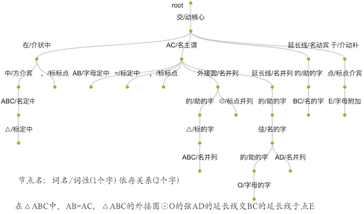

# ggb-ml

使用Python对GeoGebra数据进行机器学习的练习项目。

## 练习

- [sum_titles_1.py](sum_titles_1.py): 从GGB素材的标题中提取单词及频次。
  使用了停用词移除、单词拆分、词干提取、频率分布等方法。

  

- [sum_titles_2.py](sum_titles_2.py): 从GGB素材的标题中提取所有几何名词及其搭配。
  使用了标识化处理、相邻文本、词性标注等方法。

- [segment_1.py](segment_1.py): 基于清华THULAC和“结巴”中文分词包试验几题文本解析效果。

- [segment_2.py](segment_2.py): 基于百度自然语言处理服务试验几题文本解析效果。
  使用了词法分析和依存句法分析方法。

  

## 参考资料

- 《NLTK基础教程——用NLTK和Python库构建机器学习应用》
- [HanLP自然语言处理包开源](http://www.hankcs.com/nlp/hanlp.html)
- [百度自然语言处理服务文档](http://ai.baidu.com/docs#/NLP-Python-SDK)
- [哈工大语言云使用文档](https://www.ltp-cloud.com/document/)
- [Machine Learning最小可迭代产品](https://mp.weixin.qq.com/s/mqx9znzSFHK804AyydNiSw)
